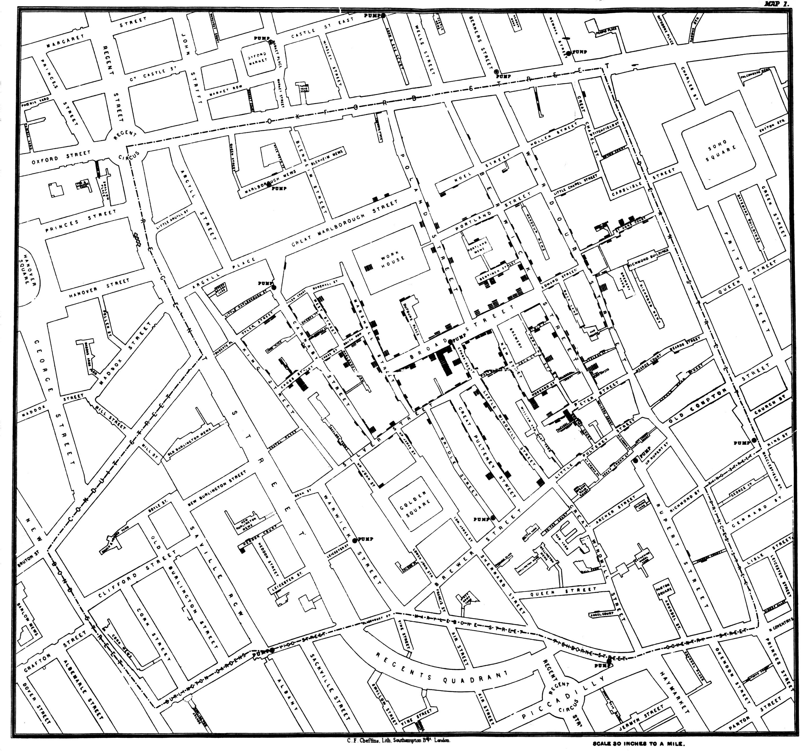
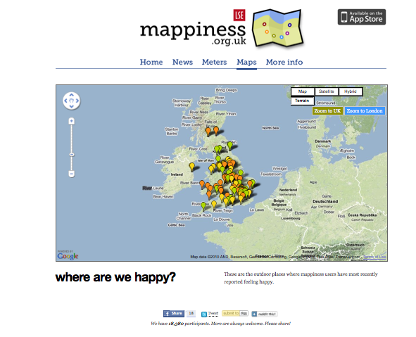
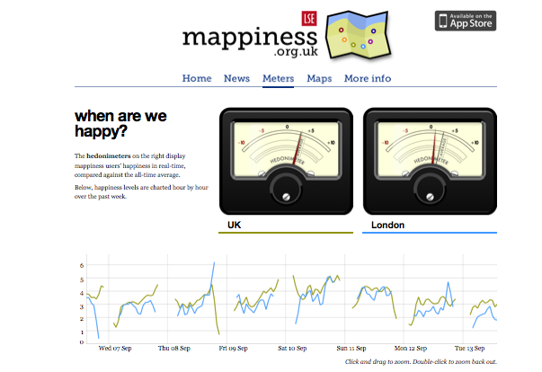

#

](images/image1.png){alt="Map of everywhere the Proclaimers could reach, if they walked 500 miles"}

## Today's agenda

- Introductions
- General housekeeping
  - GIS: a sales pitch
  - Go over syllabus
  - Talk about projects
- What you can expect to learn in this class (lots!)
- Test driving ArcGIS Pro

# Introductions 
(who am I? who are you?)

# General Housekeeping

# GIS: a sales pitch

## Eviction Lab

](images/image2.png){alt="Screenshot of the Eviction Lab interactive map interface"}

## National Zoning Atlas

](images/image3.png){alt="Screenshot of the National Zoning Atlas interactive map interface"}

## Inside Airbnb

](images/image4.png){alt="Screenshot of the Inside Airbnb interactive map interface"}

## Opportunity Atlas

](images/image5.png){alt="Screenshot of the Opportunity Atlas interactive map interface"}

## Solar eclipse & Waffle House

](images/image6.png){alt="Map of solar eclipse path and Waffle House locations"}

# Syllabus
(long, dry, full of important information)

# Projects

# What can you expect to learn in this class?

## A lot...

- How to make a useful and aesthetically pleasing map (and how difficult it is to make a really good one)
- How to analyze and interpret spatial data
  - Like how to put all the local coffee shops on a map, calculate the best route to visit each of them, and estimate how many bus stops are nearby
  - Or where in a city Airbnb prices are higher, and why
  - Or where the last remaining crimes are being reported in Washington DC
- How to work with ArcGIS Pro
- The uses and abuses of spatial data
- What is meant by GIS or GIScience (History, theory, applications, etc.)

# What's a Geographic Information System (GIS)?

## A definition

> GISs are "automated systems for the capture, storage, retrieval, analysis, and display of spatial data."
>
> --- Clarke, 1995

\

### [Another way of thinking about it]{style="color:#425823"}

>"GIS" is shorthand for a combination of spatial tools and applications, methods, concepts, and data that help us organize, visualize, and ask spatial questions

## Some things we can do with a GIS

- **Data visualization** -- for example, exploratory analysis or cartography
- **Explore geographic coincidence** -- for example, how many new firms in a region
- **Calculate geometries** -- for example, length of road in an area, or the center of a polygon
- **Identify spatial patterns** -- for example, clusters or hot spots
- **Find spatial relationships** -- for example, measuring exposure, accessibility, or market areas
- **Calculate spatial variables** -- for example, distance or proximity
- **Estimate values or density** -- for example, interpolation

## But "GIS" is so much more

- Spatial analysis
- Visualization
- Geographic data science
- AI/machine learning

Often these are all wrapped under the heading of "GIS"

## Our goal this semester

\

To get comfortable with the "grammar" of spatial data and spatial data analysis and visualization:

- Terms that are used
- Common data types
- Basics we need to know (like projections and coordinate systems)
- Common spatial methods

## How we're going to get there

\

### Lectures but also...

- Reading
- Hands-on lab activities
- Semester project

# Some examples

## Early example of spatial analysis: John Snow's 1854 Cholera Map

{alt="John Snow's map of cholera in London" fig-align="center"}

## Racial/Ethnic Segregation

; [demographics.coopercenter.org](http://demographics.coopercenter.org/DotMap/index.html)](images/image10.png){alt="Dot density map of race/ethnicity segregation in Detroit" fig-align="center"}

## Sea Level Rise in Providence

](images/image11.png){alt="Sea level rise in Providence" fig-align="center"}

## Mappiness

](images/image12.png){alt="Screenshot of the mappiness app" fig-align="center"}

## Mappiness data (map)

{alt="Map of mappiness data" fig-align="center"}

## Mappiness data (graph)

{alt="graph of mappiness data" fig-align="center"}

## Other Examples

- Habitat suitability
- Hurricane vulnerability
- Heat wave vulnerability
- Bus stop locations
- Smart growth policies

## Testing Out Our Work Environment

\

Getting set up in MyApps → ArcGIS Pro

\

From our Canvas page:

- Download lab data folder (zipped; named "GIS_Intro")
- Save to desktop
- Unzip
- Open ArcGIS Pro
- Your unzipped data folder should be called GIS_Intro
