```{r}
#| label: setup
#| include: false

library(sf)
library(ggplot2)

# load + prep the country data ONCE (all plates reuse it)
world <- st_read("../data/world_boundaries.gpkg",
                 layer = "World Bank Official Boundaries - Admin 0_all_layers",
                 quiet = TRUE)
sf_use_s2(FALSE)
world <- st_make_valid(world)
world <- world[!st_is_empty(st_geometry(world)), ]

make_plate <- function(crs,
                       clip_lat   = 90,      # 85 for Mercator; 90 otherwise
                       lon_min = -180, lon_max = 180,
                       lat_min = -clip_lat, lat_max = clip_lat,
                       ortho      = FALSE,   # TRUE only for orthographic
                       ind_radius = 500000,  # circle radius on the sphere, meters
                       col_land   = "#4e5767",
                       col_edge   = "gray",
                       col_grat   = "#42affa",
                       ind_fill   = "#C4704A",
                       ind_edge   = "#8a3f22") {

  sf_use_s2(FALSE)

  bbox_ll <- st_bbox(c(xmin = lon_min, ymin = lat_min,
                       xmax = lon_max, ymax = lat_max), crs = st_crs(4326))

 # land + graticule, cropped then projected
  land <- st_crop(world, bbox_ll)
  land <- st_make_valid(land)
  land <- st_simplify(st_transform(land, crs), dTolerance = 10000)
  grat <- st_transform(st_crop(
            st_graticule(lon = seq(-180, 180, 30),
                         lat = seq(-90, 90, 30), crs = st_crs(4326)),
            bbox_ll), crs)

  # Tissot circles: equal-area on the sphere, then reprojected
  centres <- st_as_sf(expand.grid(lon = seq(-150, 150, 60),
                                  lat = seq(-60, 60, 30)),
                      coords = c("lon", "lat"), crs = 4326)
  sf_use_s2(TRUE)
  circles <- st_buffer(centres, dist = ind_radius)
  sf_use_s2(FALSE)
  circles <- st_transform(circles, crs)

  # orthographic only: drop far-side geometry that would smear
  if (ortho) {
    land    <- suppressWarnings(st_make_valid(land))
    land    <- land[!st_is_empty(land), ]
    grat    <- grat[!st_is_empty(grat), ]
    circles <- circles[!st_is_empty(circles), ]
  }

  lim <- st_bbox(grat)

  ggplot() +
    geom_sf(data = land,    fill = col_land, colour = col_edge, linewidth = 0.1) +
    geom_sf(data = circles, fill = ind_fill, colour = ind_edge,
            linewidth = 0.3, alpha = 0.7) +
    geom_sf(data = grat,    colour = col_grat, linewidth = 0.3) +
    coord_sf(xlim = c(lim["xmin"], lim["xmax"]),
             ylim = c(lim["ymin"], lim["ymax"]), expand = FALSE) +
    theme_void() +
    theme(panel.background = element_rect(fill = NA, colour = NA),
          plot.background  = element_rect(fill = NA, colour = NA))
}

```

## 

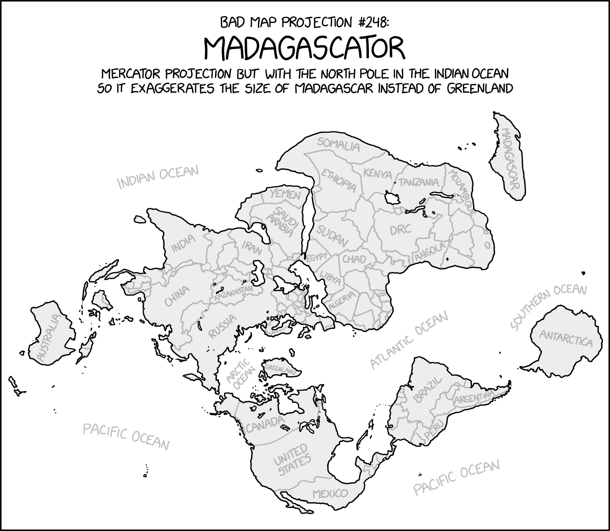{alt="xkcd comic"}

## Today's agenda

- General housekeeping: Lingering Questions?
- Lecture:
  - How does a GIS organize spatial data?
  - Coordinate systems and projections
- Reading discussion
- Lab

## Organizing Spatial Data in a GIS

- A GIS doesn't save information as maps
  - Rather, we tell the GIS how to locate objects in relation to other objects and in space
- Things to be aware of:
  - Your spatial data model
  - The relationships your objects have with each other in the real world
    - e.g. street intersections or shared state borders
    - We call this "topology"

# How does a GIS organize spatial data?

## Spatial Data Models

Most common are vector and raster

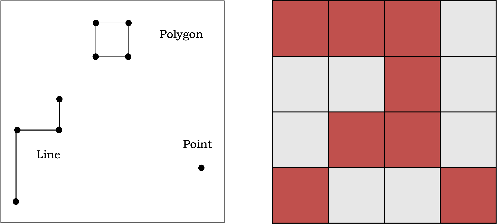{alt="Abstract visual of vector and raster data"}

## Spatial Data Models

Most common are vector and raster

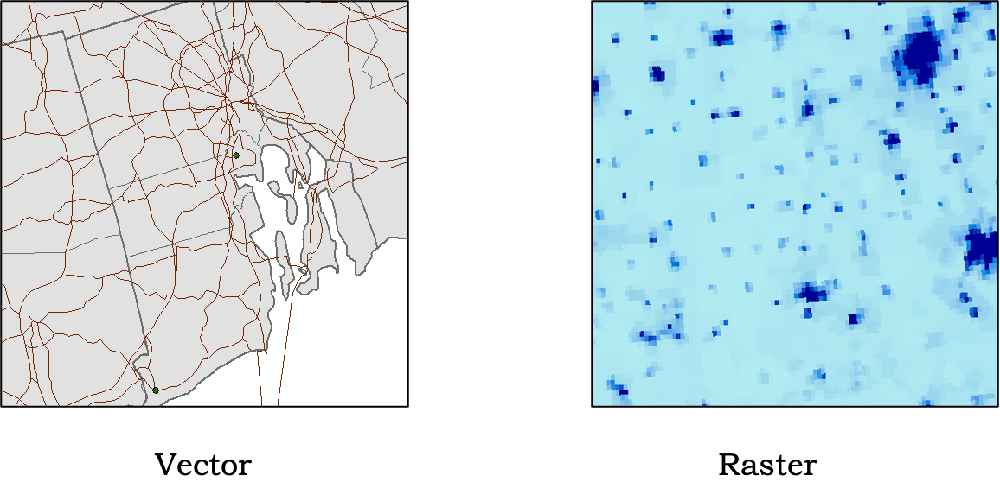

## Spatial Data Models

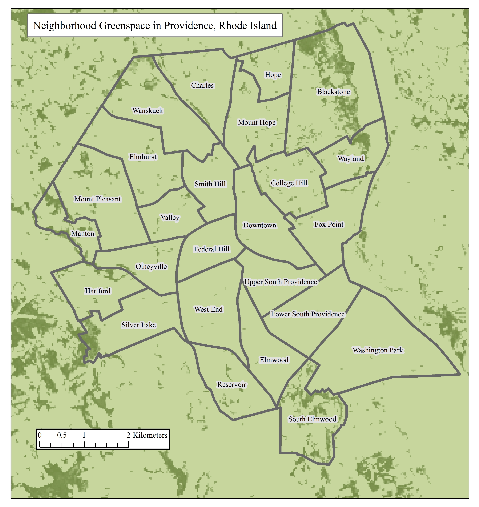{alt="Map combining vector and raster data"}

## Vector Model

- Features are stored as discrete points, lines or polygons
- All are combinations of nodes and/or vertices
- Locations are recorded as X,Y coordinates

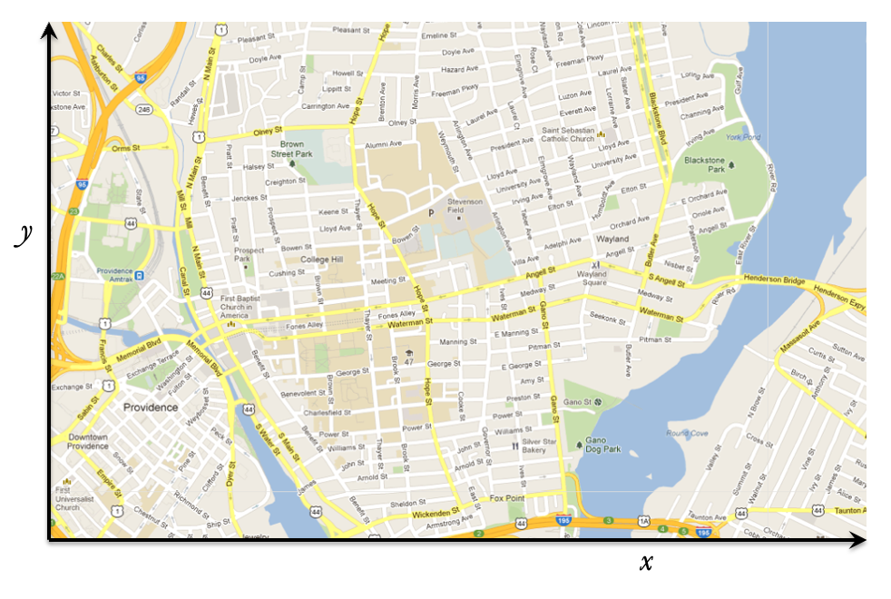

## Vector Model

- Features are stored as discrete points, lines or polygons
- All are combinations of nodes and/or vertices
- Locations are recorded as X,Y coordinates

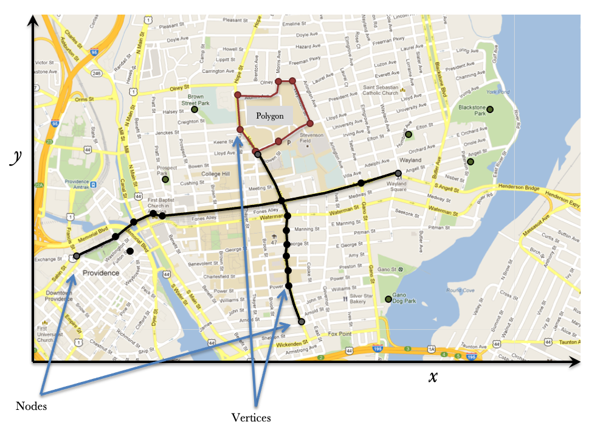

## The Attribute Table

- Each feature – point, line, or polygon – is dynamically linked to the "attribute table" or set of variables
  - For example, you could have a dataset of cities, represented as points, and the attribute table might contain characteristics of the city – population, for example

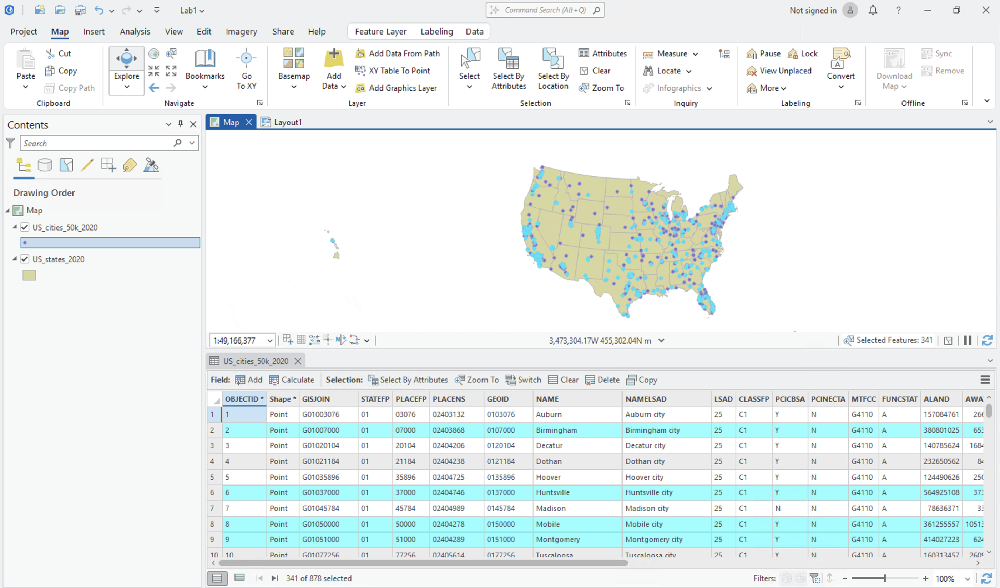{alt="Figure showing dynamic linking of map and attribute table"}

## Types of Feature Classes

:::: {.columns}

::: {.column width="50%"}

- Feature classes – or datasets of spatial objects – contain only the same types of objects
  - This means only points or lines or polygons
  - And since they all share the same attribute table, they should be the same thing
    - So, no combining cities and septic systems in one feature class, even though both might be points
    - Each group of features is referred to as a feature class
    
:::

::: {.column width="50%" style="text-align: right;"}

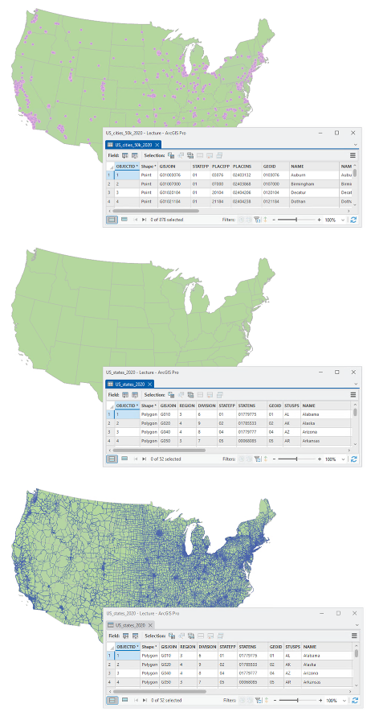{width=60%}

:::

::::


## This is our Nation's Capital…

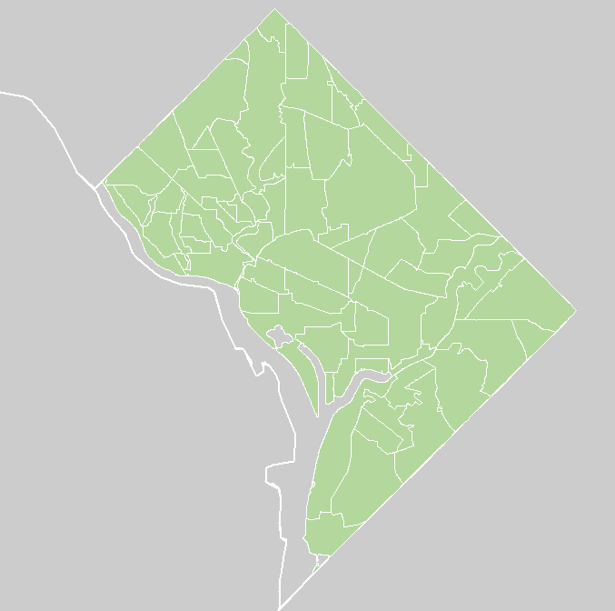{alt="Map of Washington DC"}

- …But what can we say about the type of spatial data the map shows?
- Knowing whether we're working with lines or polygons is key to understanding what types of analysis we can do.

## Why We Like the Vector Model

- Features can be located precisely
- We can store lots of information (variables or attributes) about each feature
- Useful for many types of map-making
- Perfect for types of analysis, such as areas, lengths, or connections
- Used a lot in the social sciences

## Raster Data Model

:::: {.columns}

::: {.column width="50%"}

- Sub-divides a study area into square pixels – rows and columns
- Only need the location of the upper left-hand corner and all other locations are implicit, assuming you know your pixel size
- Only one value is recorded for each pixel
  - For example, temperature, precipitation, or land use type
    
:::

::: {.column width="50%" style="text-align: right;"}

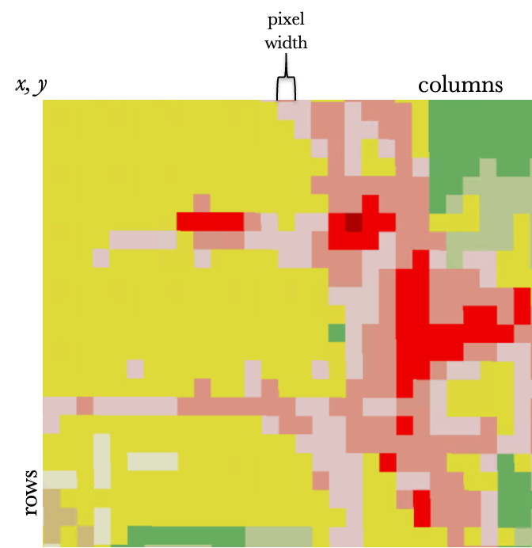{width=90%}

:::

::::

## Raster Data Model

So long as the x, y location is georeferenced (placed on the surface of the earth), we can locate each other pixel, too

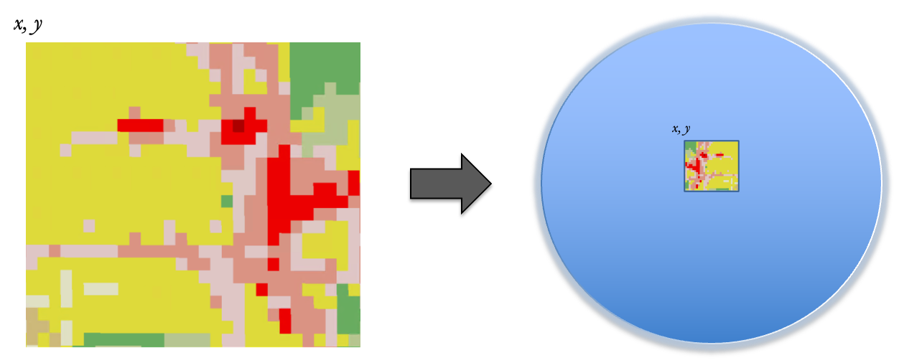

## Raster Data Model

- There are at least two contexts in which raster data may make more sense than vector data:
  1. When you're working with continuous data, like the types of information mentioned above: e.g. precipitation or temperature
      - Often, these types of information weren't collected for administrative units, anyway, so it makes little sense to organize them that way
  2. Applications that involve the environmental sciences (see reason 1 for a good reason why)

\

Remember that rasters don't have attribute tables – each cell or pixel is only going to have one value attached to it

## Raster Data Model

Rasters can be used to represent continuous data

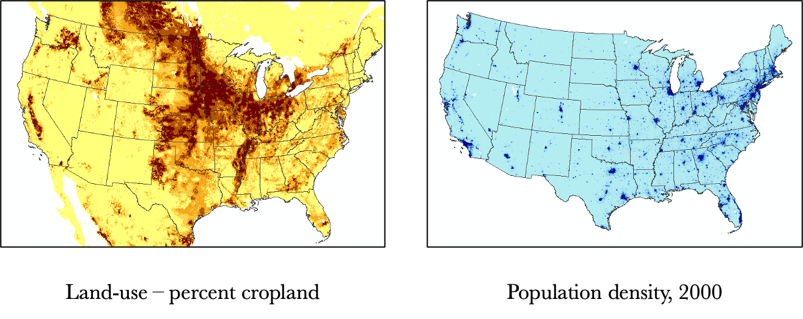

## Raster Data Model

Or discrete data

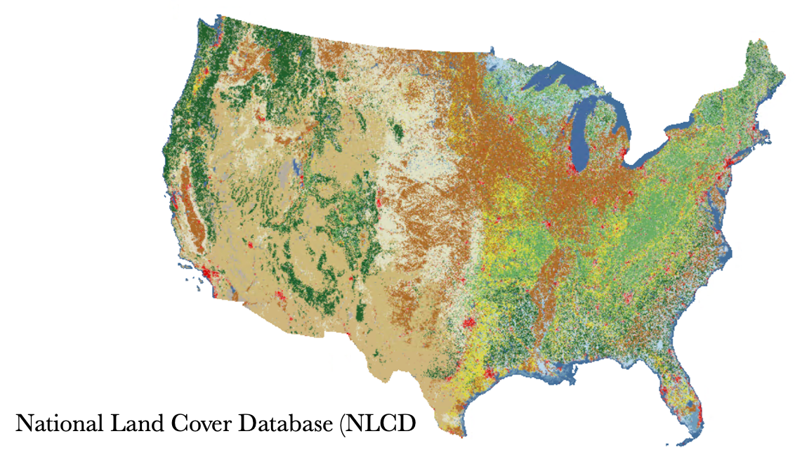

## Why We Like the Raster Model

- Best for continuous data
- Analysis can sometimes be faster
- And some types of analysis require raster data
- Remember: pixel size (or resolution) matters!

## Vector versus raster

\
\
\


> "Yes, raster is faster, but raster is vaster, and vector just seems more correcter." 
– Dana Tomlin

## Picture files

](images/image14.jpg){alt="Historical Sanborn map for Providence" width=50%}

- Any map picture file could potentially be used as a GIS data source
- BUT, the picture has to be georeferenced, or registered to a known coordinate system, first

# ArcGIS Pro and File Types

## The GIS Commandments

- Thou shalt not (ever) use Windows to copy or move files! (Use Catalog)
- Thou shalt not work from the Downloads folder.
- Thou shalt understand how file directories are structured (even if you wish you didn't need to).
- Know your projection.
- Save projects early and often!
- Thou shalt google (look things up when you have questions).
- Embrace mistakes (you will make mistakes).

## ArcGIS Pro and File Types

- When you do work in ArcGIS Pro, your efforts are saved as a project
  - Your project links to the data you've added, but does not actually include said data
  - If you copy your project to another location, without moving the individual layers as well, your project will be empty when you open it
  - ArcGIS Pro tries to help you out by creating a project folder and default geodatabase when you start a project

## ArcGIS Pro and File Types

- Vector data are typically stored as shapefiles or as elements of a geodatabase or geopackage, although other formats exist
  - Shapefiles are typically recognized by other GIS software applications and this is the term often used to refer to spatial data
  - Geodatabases can include feature classes, but also raster data and even spreadsheet (e.g. MS Excel) data
    - These look like a cylinder in ArcGIS Pro; when you expand the cylinder, you see all the data included in the geodatabase
    - This is an Esri proprietary file format
  - Geopackages are similar to geodatabases
- Both shapefiles and geodatabases will look unrecognizable in Windows

# Modeling feature behaviors

## Topology – Modeling Feature Behavior

- Topology sets the rules of behavior for features in a feature class
- Basic topology rules deal with adjacency, connectivity, overlap, and intersection
- A classic example is road networks


##

:::: {.columns}

::: {.column width="40%"}

\

- We all understand where the U.S. is:
  - Implicitly, we step out of Minnesota to the north and we're in Canada
  - Our data need to reflect this: adjacency
  - One border
- Or street intersections
:::

::: {.column width="60%"}

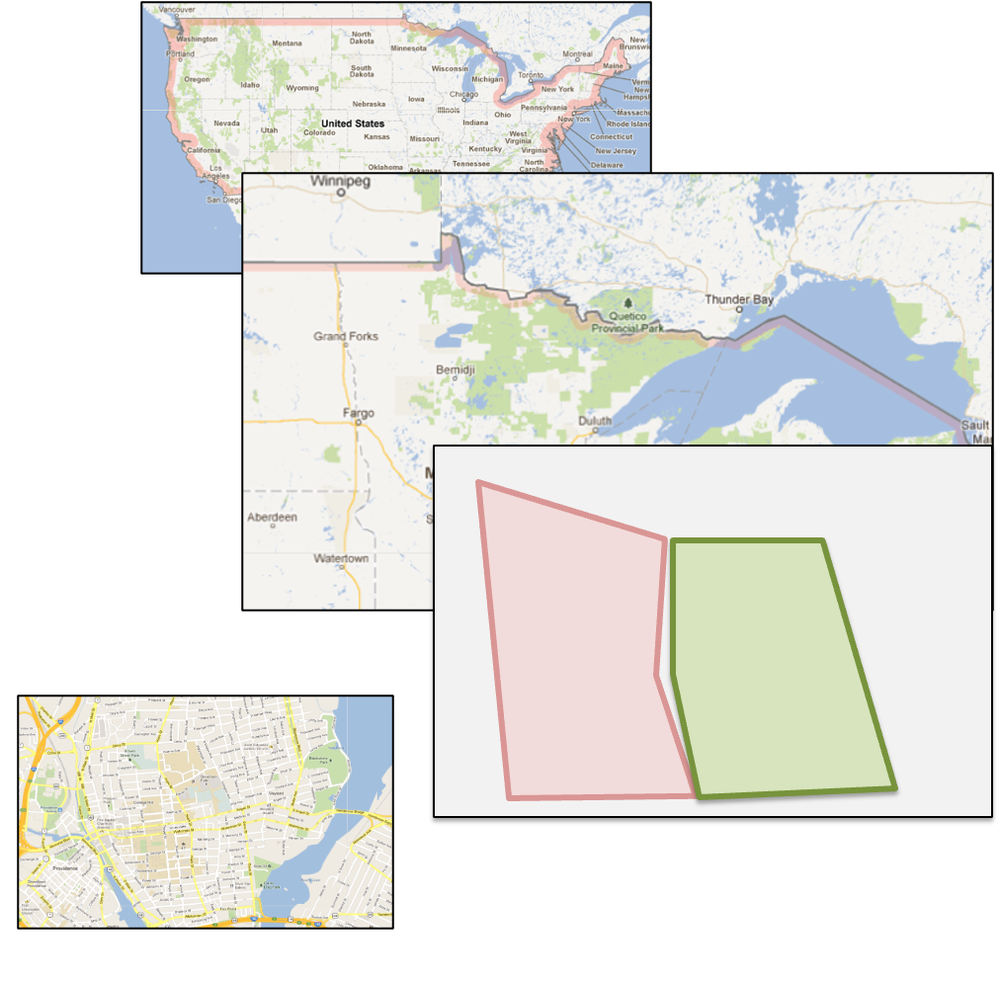

:::

::::

## It All Comes Down to Logical Consistency

- How well do features mimic real-world situations?
- As users, rather than generators, of data, we often have no control over the quality of the data we have to work with
- Many of these issues won't be apparent if we're only making maps, but can wreak havoc with analysis

# Coordinate systems and projections

## How to we translate spherical locations to map locations?

- To do that, we need to discuss:
  - Characterizing the shape of the earth
  - Projections
  - Coordinate Systems

## The shape of the earth {.smaller}

- Obviously not flat, but not perfectly round either
  - More like an oblate **spheroid** or **ellipsoid** (someone sat on the top of it a bit)
- And as technology has advanced, we've been able to be more precise about the exact shape
  - Now satellites, rather than just surveying
- A **datum** is an estimate of the ellipsoid and measures the elevation of every point on earth
  - Recent datums use the center of the earth as the reference point, not a point on the ground
  - North American Datum of 1983 (NAD83) is most recent datum for the US
  - At large scales, differences in datum used can make a big difference
- **Geoids**, based on science of geodesy, provide exact measurements of earth's size and shape (and gravitational fields)
  - Rarely necessary in GIS

## How do we find locations on the Earth?

:::: {.columns}

::: {.column width="60%"}

\
\

- **Latitude**: parallels, measured north and south of the equator
- **Longitude**: meridians are like orange segments, measured against the prime meridian

:::

::: {.column width="40%"}

\


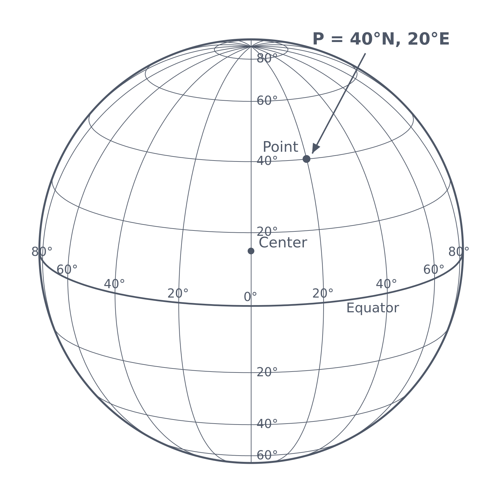{alt="Figure showing a globe and how latitude and longitude work"}
:::

::::

## Coordinate Systems – locating a place on the surface of the earth {.smaller}

- **Geographic Coordinates** – latitude and longitude, expressed as numbers
- **Universal Transverse Mercator (UTM)** – Uses transverse Mercator projection, which is accurate in North-South strips.
  - Divides the earth into 60 zones.
  - Not used in polar regions – too much distortion
- **Military Grid** – Uses a lettering system (CDE, 123) with 60 zones
- **State Plane System** – Used for **a lot** of geographic information in the US.
  - Based on a different map of each state, and each state is divided into a number of zones, depending how large it is (one for RI).
  - Very little distortion, because of the small areas covered.
  - Can be a pain if you're working with data for more than one state.

## Map Projection

- Putting the round earth onto a flat surface (paper, computer screen, projector screen)
- Sphere is "projected" onto plane, cone, or cylinder
  - Azimuthal
  - Conic
  - Cylindrical
- How do these shapes intersect the earth's surface?

## Types of Projections

- Projections can be measured by how they distort the earth's surface:
  - **Conformal** projections are shape-preserving
    - Lines of latitude and longitude will meet at right angles
    - They preserve direction and so are used in cases where measuring direction is important
  - **Equal area** or equivalent projections preserve area
    - Area is portrayed correctly, as on a sphere
  - **Distance preserving** projections (but only along a few lines
  - Compromise projections

## Orthographic
Conic (obviously) and preserves area while distoring shape

```{r}
#| echo: false
#| dev: "svg"
#| dev.args: !expr list(bg = "transparent")
#| fig-width: 7
#| fig-height: 7

make_plate("+proj=ortho +lat_0=40 +lon_0=-100 +datum=WGS84 +units=m +no_defs",
           ortho = TRUE)
```

## Mercator
Cylindrical and shape (and angle) preserving

```{r}
#| echo: false
#| dev: "svg"
#| dev.args: !expr list(bg = "transparent")
#| fig-width: 7
#| fig-height: 7

make_plate("+proj=merc +lon_0=0 +datum=WGS84 +units=m +no_defs", clip_lat = 85)

```

## Gall-Peters
Cylindrical and equal-area (but shape-distorting)

```{r}
#| echo: false
#| dev: "svg"
#| dev.args: !expr list(bg = "transparent")
#| fig-width: 7
#| fig-height: 7

make_plate("+proj=cea +lat_ts=45 +datum=WGS84 +units=m +no_defs")

```

## Albers Equal-Area Conic
Conic (obviously) and preserves area while distoring shape

```{r}
#| echo: false
#| dev: "svg"
#| dev.args: !expr list(bg = "transparent")
#| fig-width: 7
#| fig-height: 7

make_plate("+proj=aea +lat_1=29.5 +lat_2=45.5 +lon_0=-96 +datum=WGS84 +units=m +no_defs",
           lon_min = -170, lon_max = -50, lat_min = 15, lat_max = 75)
```

## Lambert Conformal Conic
Conic but preserving shape (and angle)

```{r}
#| echo: false
#| dev: "svg"
#| dev.args: !expr list(bg = "transparent")
#| fig-width: 7
#| fig-height: 7

make_plate("+proj=lcc +lat_1=33 +lat_2=45 +lon_0=-96 +datum=WGS84 +units=m +no_defs",
           lon_min = -180, lon_max = 0, lat_min = 0, lat_max = 85)
```

## Lambert Azimuthal Equal-Area
Planar (preserves area while distorting shape)

```{r}
#| echo: false
#| dev: "svg"
#| dev.args: !expr list(bg = "transparent")
#| fig-width: 7
#| fig-height: 7

make_plate("+proj=laea +lat_0=40 +lon_0=-100 +datum=WGS84 +units=m +no_defs",
           lon_min = -180, lon_max = 0, lat_min = 0, lat_max = 85)
```

## Important to remember:

- Any projection distorts *either* distance, shape, area, or direction.  No projection is perfect
- The larger the area involved, the larger the impact of map errors due to projection
- Projection used should suit the GIS application
- Maps must be in the same projection if they'll be overlayed or stitched together
- Usually a GIS can switch from one projection to another

## 

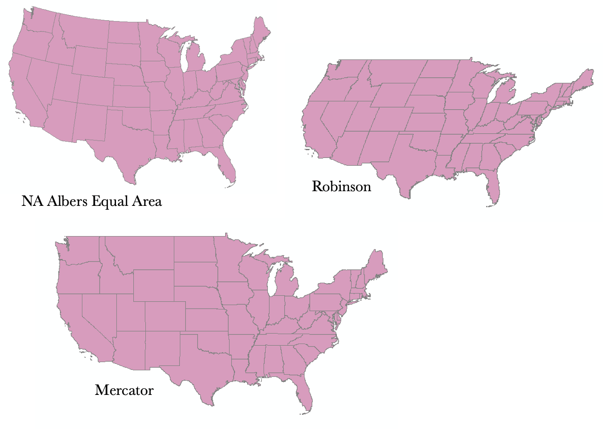

## Why does this matter?

\
\

- When we add data to our GIS from different sources, we need the information to "line up" nicely – so we need to know the projection and it should be the same for all layers
- If the type of analysis we're going to be doing involves area measurement or distance, for example, we want to make sure we're using an appropriate projection.
