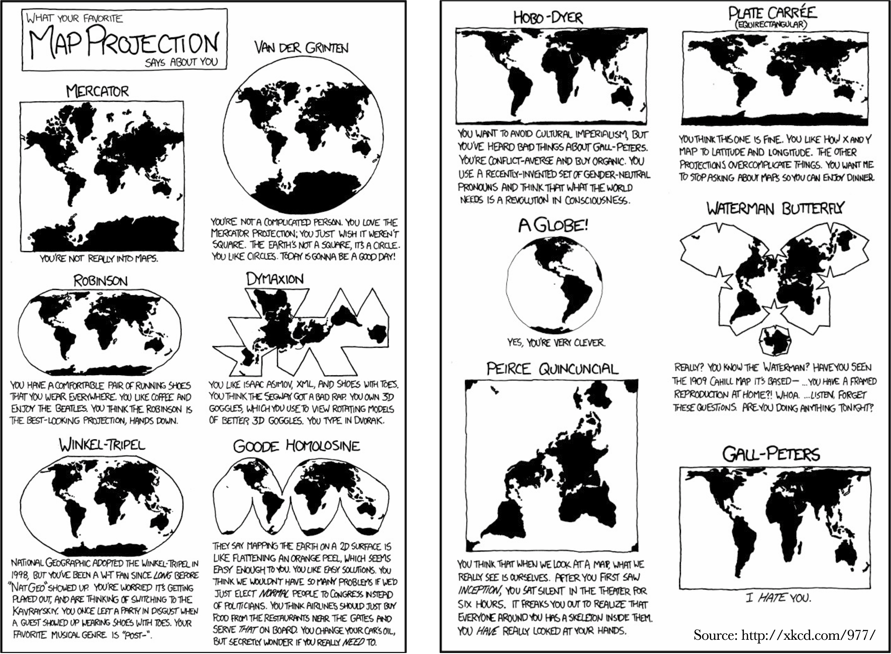
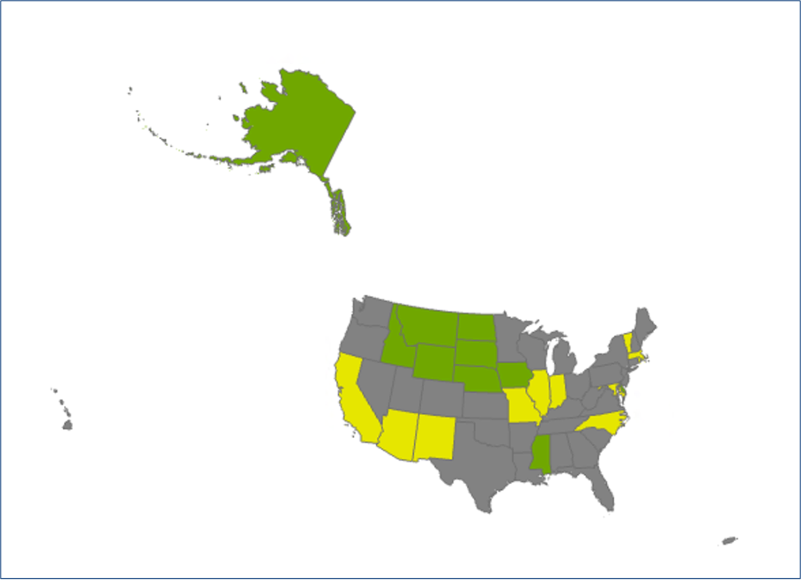
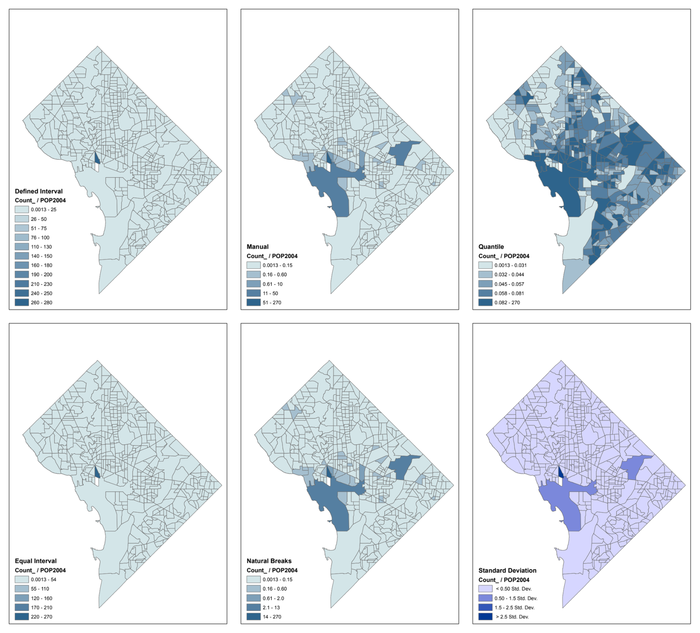
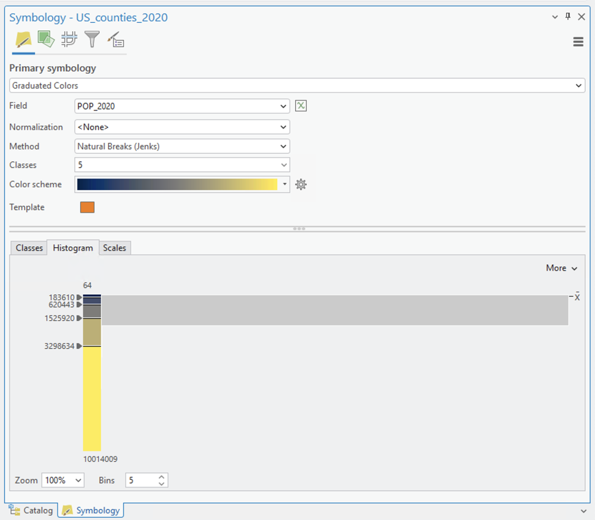
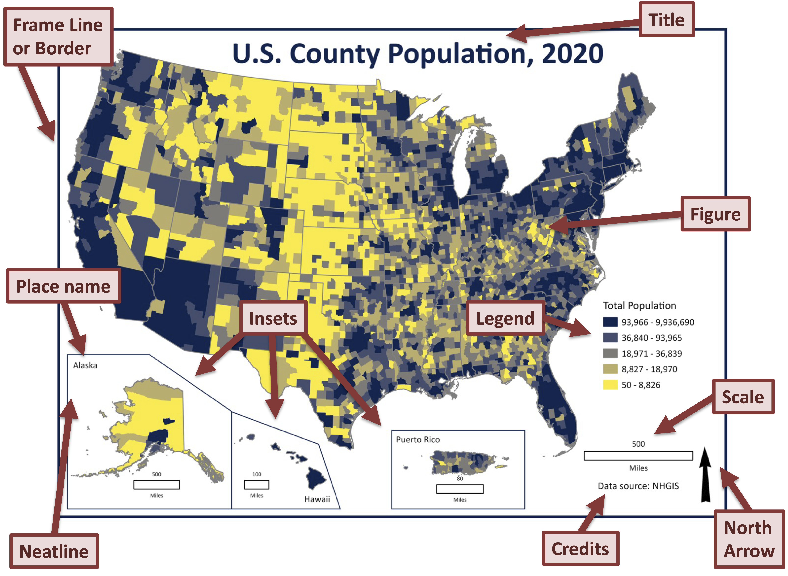
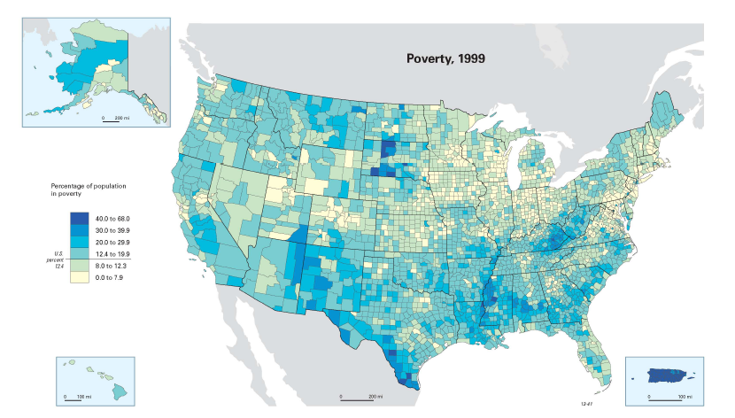
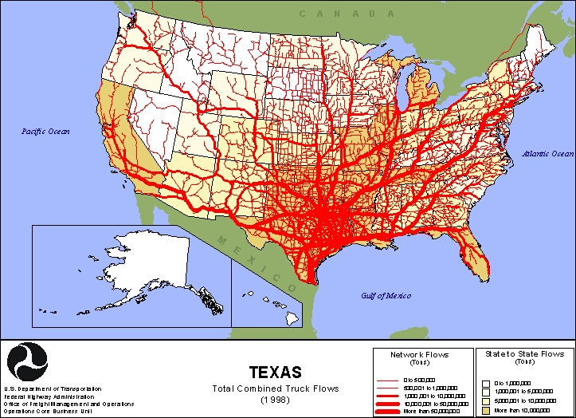
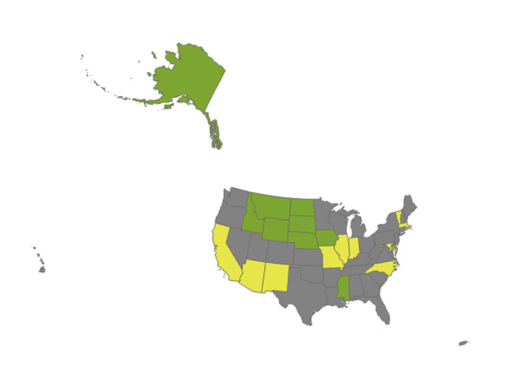

## 

{alt="xkcd comic"}

## Today's agenda

- General housekeeping: Any Questions?
- Lecture:  Cartography
  - Types of data
  - Types of maps
  - Classifying data
  - Examples of maps
- Goals:
  - Comfort with basic cartographic principles
  - Ability to match symbology to data type
  - Introduction to map elements

## 

{alt="Map of states I've lived in"}

## Cartography

\
\

**The drawing of maps or charts.** --- Oxford English Dictionary

\

**The science or art of making maps.** --- Merriam-Webster Dictionary

\

**The study and practice of making maps.** --- Wikipedia

## This cartographic technique has a name:
Chernoff faces

](images/image3.png)

## Types of data{.smaller}

- **Nominal** – Information that names or identifies objects
  - Could be text or a number, but we wouldn't do math with the number
  - Examples: County names or census tract numbers
  - Represented on a map using labels
- **Categorical** – Information that is classified into groups, classes, or categories with no ranking involved
  - Again, the information could be text or a number, but we wouldn't do math with the number
  - Examples: urban/rural; residential/commercial/agricultural
  - Represented on a map using unique value maps
- **Ordinal** – Information is classified into groups, but there is an assumed ranking to the categories
  - For example: Opinion polls, income, or educational attainment
  - Represented on a map using either graduated color or unique value maps

## Type of Data, continued

- **Numeric** – Information stored as numbers, with a regularly spaced measurement scale
  - Often continuous data, such as income or rainfall
  - Ratio data are numeric information with a meaningful zero value, such as no rainfall, income, or height
    - Doing math with these types of data makes common sense
  - Interval data re the same as ratio data, but do not have a meaningful zero point
    - Data with negative values must be interval

## Representing different kinds of information

- The way in which we display data on the map needs to match not only the type of data but also the type of feature
  - Nominal – labels
  - Categorical  – different symbol or color for each category
  - Ordinal – we want to use color or symbol size to convey the increase in value that goes with each category
    - Graduated or proportional symbol maps.
  - Numerical – for points and lines, we use lines thickness or symbol size to express variations in value
    - For polygons we use graduated color or choropleth maps
    - Single color that changes in intensity to convey changes in value
    - Sometimes two colors are used

## Classification Schemes

- Mapping continuous data means we need a meaningful way to create categories – this is called classification
- Similar to choices that are made in generating a histogram
- How we allocate values to categories will affect our final map
  - This means number of categories
  - But also the classification scheme itself
- Ideally you are able to justify your choices (good general advice!)
  - What is the takeaway message you want to convey?
  - Who is your audience?

## Most common types of classification

- **Natural breaks (Jenks)** – looks at the distribution of values and sets the break points at "natural breaks" in the data
- **Equal interval** – Creates a set number of classes of equal size
- **Fixed interval** – Same as equal interval, except you decide the size of the interval and the number of classes depends on that decision (e.g., by 1,000s)
- **Quantile (equal count)** – puts the same number of features into each class
- **Standard deviation** – creates categories based on the number of standard deviations away from the mean
- **Manual** – you choose the break points yourself

## Example – Reported crime in Washington, DC

{width="90%"}

## 

{alt="Screenshot of ArcGIS pro classification window"}

# Map Design

## What do we need to think about?

- **Map elements** – the pieces of a map that make it a finished (and polished product)
  - Individual elements should contribute to conveying information, not detract from it
  - Limit clumping together of elements
  - Limit use of multiple fonts and colors
- **Map symbology** – the way in which the information the map conveys is portrayed
  - Colors – hue, intensity, and saturation
  - Symbols – size and type
- By necessity, maps are selective of the information they show and information is generalized

## Choosing symbols and colors

- Beauty is in the eye of the beholder, but there are some general guidelines!
- Water and land should not be given unusual colors—e.g., water is blue not red
- Increased thickness of lines or larger symbols should match increased value
- Darker or more intense colors usually go with higher values
- If you use a color ramp with two colors, your data should also reflect two extremes in value—for example, in and out migration or voting patterns
- Avoid mixing and matching lots of different patterns on the same map—the eye can't handle it

## 

](images/image11.png){alt="Screenshot of Color Brewer interface"}

## Map Scale

- Often referred to as the "representative fraction"
  - Relationship of units on the ground to map units
  - The fraction or ratio of objects on the page to real life objects
- Common USGS scale for topographical maps is 1:24,000
- 1:100,000 means one centimeter on the map is equivalent to 100,000 centimeters (or 1 km) in the real world
- Fitting a map of the world into two book pages requires a scale of about 1:100,000,000
- Scale is unitless – we could be talking about 1 foot to 24,000 feet or 1 meter to 24,000 meters

## What makes a "map"?

- Cartographic elements:
  - Title
  - Neatline
  - Scale bar
  - Legend
  - North arrow
  - Inset map

## 

# Types of Maps (some examples)

## So many ways to visualize information on a map!{.smaller}

- **Thematic Maps** – organize and display spatial variation of a single variable
- **Choropleth maps** – changes in a variable are classified and mapped by some administrative category (e.g. countries or states)
- **Dasymetric maps** – Uses additional information to allocate value within polygons
- **Isoline** or **contour maps** – lines delineate areas of similar value. E.g., air pressure or elevation
- **Reference maps** – may display lots of different types of information
  - Topological maps or atlases
- **Dot maps**, **picture symbol maps**, **graduated symbol maps**
- **Network and flow maps** – show direction and magnitude of flows
- **Cartograms**---a unit's display area is determined not by its actual area but by an attribute value

## 

{alt="Map of US county poverty levels for 1999"}

## 

](images/image14.png)

## 

](images/image15.png)

## 

](images/image16.png)

## 

](images/image17.png){alt="Example of dot density map"}

## 

{alt="Example of a network map"}

## Flow map (a famous one!)

](images/image19.png)

## 2016 Presidential Vote

](images/image20.png){alt="County-level map of the 2016 presidential vote"}

## 2016 Presidential Vote

](images/image21.png){alt="Cartogram of the 2016 presidential vote"}

## 

](images/image22.png)

# Maps are more than just pretty objects

## Questions we can ask about maps and spatial data

- What are the high and low values and where are they?
- Does there appear to be a relationship between location and value?
- Do similar values appear to be located close together, or clustered?  Is another spatial pattern discernible?
- Are there characteristics of areas that appear to correspond with particular sets of values?  e.g. coastal or inner city.
- Would the pattern change if we change the scale of analysis?  For example, what happens to the spatial pattern if we go from counties to states?

## 

{alt="Map of states I've lived in"}

So, knowing what we now know, how can we turn this into a nice map composition?
