## 

](images/l5_image1.png){alt="xkcd cartoon"}


## Today's agenda

- General housekeeping: Any Questions?
- Lecture:
  - A few cartographic considerations
  - Data Management & Manipulation
    - Data models, Database Management Systems (DBMS), key DBMS functionality
  - Basic ArcGIS Pro data management functionality
  - Collecting our own data in the field
    - DIY (Excel, paper and pen, etc)
    - Online forms
    - Other options

## More cartographic considerations

- What is the purpose of the map?
- Who is your audience?
- How will your audience be viewing the map?
- Think about including additional map layers and information that will improve your map, both aesthetically and in terms of the information you're trying to convey
- Pay attention to projection!

## Basemaps in ArcGIS Pro

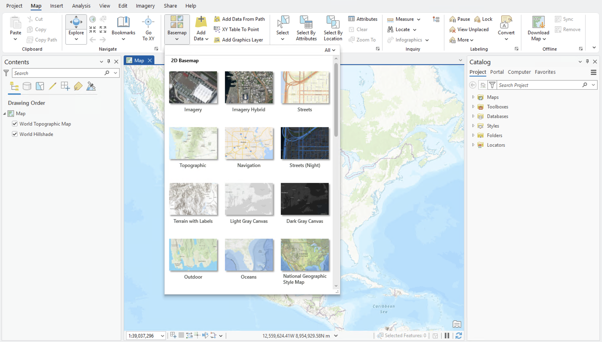{alt="Screenshot of ArcGIS Pro interface"}

## Data

- Data are pieces of information
- Databases are forms of data organization that allow us to easily retrieve data
  - How the data are organized will determine what kinds of information we can retrieve about the data
  - Example: the phone book
- Data models – logical constructs for storage and retrieval of data

## Data elements

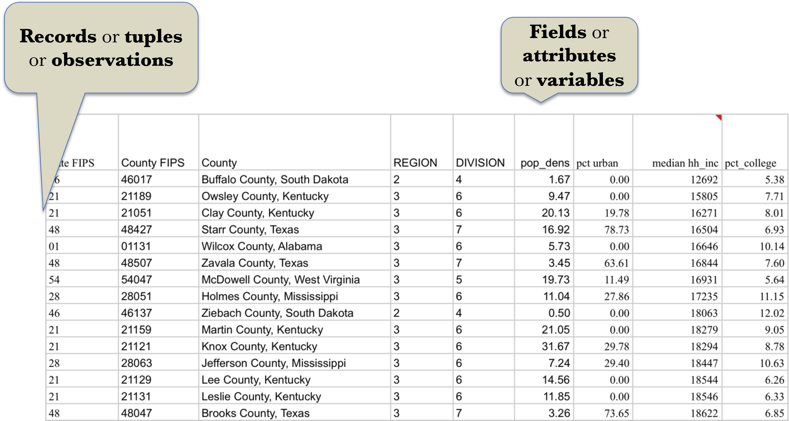{alt="Screenshot of Excel spreadsheet"}

- Fields or attributes or variables
- Records or tuples or observations

## Data Tables in ArcGIS Pro

:::: {.columns}

::: {.column width = "50%"}
- Attribute tables
  - These are the tables that accompany feature classes (points, lines, polygons)
  - Right click on layer and open table
- Standalone tables
  - Tables that are not associated with a feature class
    - For example summary statistics
    - Or a table of data for places
:::

::: {.column width = "50%"}
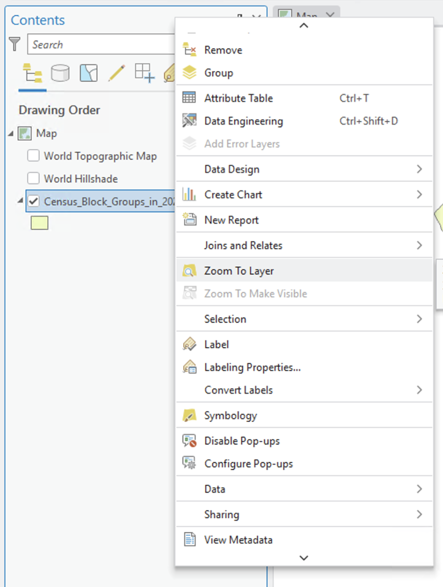{alt="Screenshot of ArcGIS Pro interface" width="85%"}
:::

::::

## Data in a GIS environment

- Spatial data model – How the spatial element of the data is organized
  - Vector v. raster
  - Information about location and topology of our points, lines, and polygons
- Attribute data model – data that provide information about characteristics of the spatial features
  - Attribute or standalone tables

## Database management systems (DBMS)

- Elements of a DBMS:
  - Data definition language – Allows user to set up or define new database, including numbers and types of attributes
  - Data dictionary – Catalog of attributes and their "legal" values and ranges
  - Data entry – Ways to enter new data and ensure they follow the rules laid out by the data dictionary
  - Verification and updating – Deleting, modifying, or inserting records and creating reports
- Information can be stored in binary or ASCII format

## Field types

- Databases like to have the same kind of information in a field
  - E.g. numbers, strings, or dates
  - But also information on:
    - Length – how many letters in a string field
    - Precision – how many numbers in a numerical field
    - Scale – the number of decimal places
  - Generally, once we define a field, its type cannot be changed

##

```{r}
#| echo: false
#| message: false
#| warning: false

library(gt)
library(tibble)

# Field types table
field_types <- tribble(
  ~Type,     ~Description,                                                              ~Example,
  "Short Integer",   "Whole numbers with no decimal places (values range from -–32768 through 32767)", "100\n15000",
  "Long Integer",    "Long whole numbers (values range from -2.4 billion to +2.4 billion)", "331449281",
  "Float",   "Numbers that requires decimal places; limited in how many digits can be stored",         "1986.37",
  "Double",  "Big numbers (up to 15 digits) before and after decimal", "13.6737583",
  "Text",    "Alphanumeric strings",                                                    "'Hope St.'",
  "Date",    "Date format",                                                             "10/06/26",
  "BLOB",    "Binary Large OBject; including images, documents, or code", ""
)

# Your Northumberland palette
green  <- "#425823"
teal   <- "#1F5673"
body   <- "#4e5767"
bg     <- "#fbfbfb"
header <- "#B7D4D4"
font   <- "Futura"

field_types |>
  gt() |>
  tab_header(title = md("**Common field types**")) |>
  cols_label(
    Type = "", Description = "", Example = ""
  ) |>
  tab_options(
    table.font.names          = green,
    table.font.color          = green,
    table.background.color    = body,
    table.border.top.color    = body,
    table.border.bottom.color = body,
    heading.background.color  = header,
    heading.title.font.size   = px(18),
    column_labels.hidden      = TRUE,
    data_row.padding          = px(8)
  ) |>
  tab_style(
    style = list(
      cell_text(weight = "bold", color = green),
      cell_fill(color = header)
    ),
    locations = cells_body(columns = Type)
  ) |>
  tab_style(
    style = cell_text(color = green, font = font),
    locations = cells_title()
  ) |>
  tab_style(
    style = cell_borders(sides = "all", color = "#cfcfcf", weight = px(1)),
    locations = cells_body()
  ) |>
  cols_width(
    Type ~ px(90),
    Description ~ px(380),
    Example ~ px(150)
  ) |>
  gtsave("images/field_types.png", expand = 10)
```

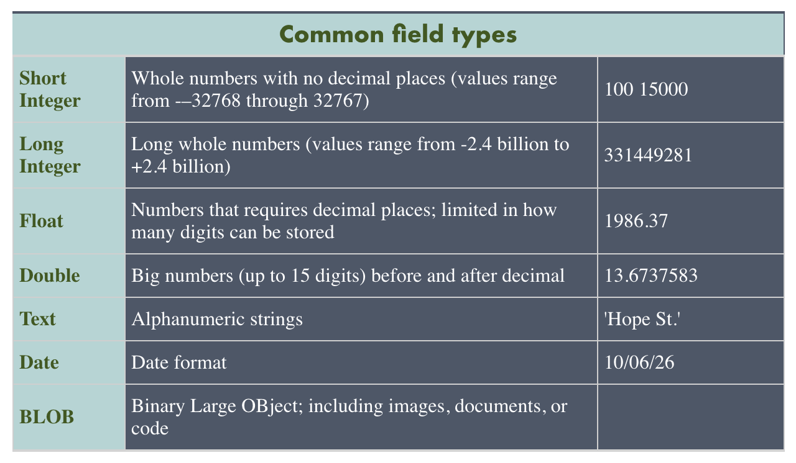{alt="Table of common field types with descriptions and examples"}1

## Generating New Fields in ArcGIS Pro

- You've done this already!
- A major function of working in a GIS is the creation or generation of new information, or variables
  - Much of our work this semester will cover ways of generating spatial variables (e.g., distance or density)
  - We also create new variables based on existing variables, however
    - For example, percent population that is x = (total x population/total population)*100

## Generating New Fields in ArcMap

:::: {.columns}

::: {.column width="50%"}

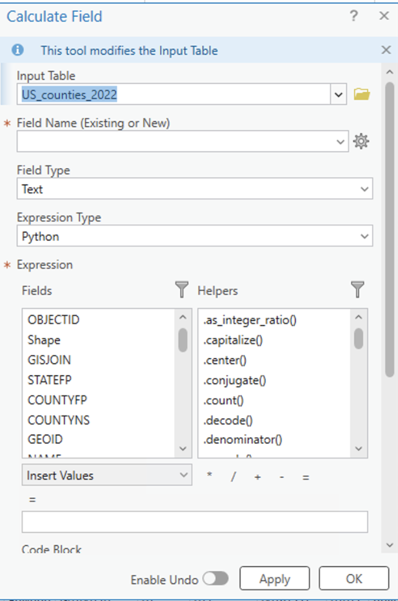{alt="Screenshot of ArcGIS Pro interface" width="75%"}
:::

::: {.column width="50%"}
- Easiest to think of creating new variables as a two-step process:
- Creating a new field (column)
  - What name?
  - What format?
- Populating that field with values
:::

::::

## Basic DBMS Functions

:::: {.columns}

::: {.column width = "33%"}

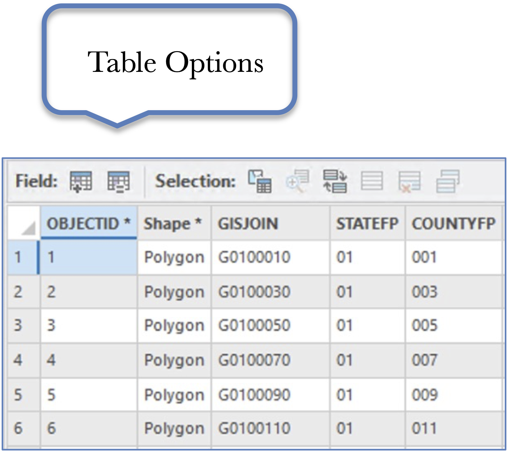{alt="Screenshot of ArcGIS Pro interface"}

:::

::: {.column width = "33%"}

- Sorting
- Reordering
- Subsetting
- Searching
- And we want to be able to apply these functions by attribute and by location
  - For example, high to low income or distance from some point, close to far
 
:::

::: {.column width = "34%"}

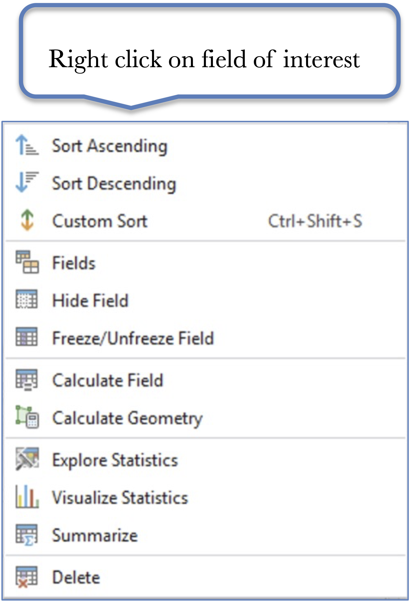{alt="Screenshot of ArcGIS Pro interface"}
:::

::::

## Types of DBMS

- Flat files – simple, but not efficient
- Hierarchical – inflexible relationships
- Relational – multiple tables, but relationships between tables are defined as needed
  - Importance of the "primary key"
- Object and Object-Relational – better for storing complete objects and and object behavior, but not as popular as relational databases

## Codd's Five Database Rules

- Only one value is stored at any intersection of row and column.
- All values in a column deal with the same subject.
- Each row is unique.
- There is no significance to the sequence of rows.
- There is no significance to the sequence of columns.

## Querying a database

- Types of queries
  - Attribute queries
  - Spatial queries

## Attribute queries

- Attribute queries create a subset of records or features that meet the query criteria
- Can be simple, like "Find California"
  - This can be done by sorting, browsing, or searching
- Or selecting features that meet particular criteria (like minimum city size)
- Once we've created our selection we can:
  - Generate summary statistics
  - Create new feature class or shapefile
  - Create new variables that label features as having a particular characteristic

## Attribute queries

- ArcGIS uses Structured Query Language (SQL)
  - Common database query language
  - Basically a logical expression that generates a selected set of records
    - For example, all cities larger than 50,000 inhabitants
    - Or all "highly active" volcanoes
    - We can then "summarize" information based on our selected set of cities – e.g. median income for all cities greater than 50,000 inhabitants
  - In ArcGIS Pro we use Select by Attribute

## Attribute queries

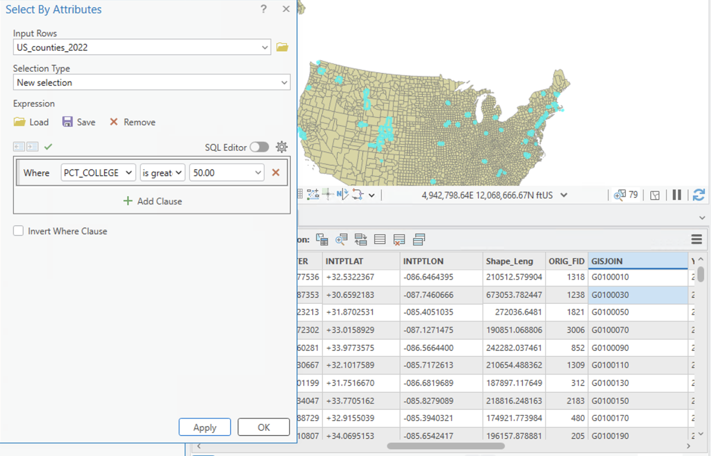{alt="Screenshot of ArcGIS Pro interface"}

## Spatial queries {.smaller}

- Spatial queries also generate a subset of features, but not based on their attribute characteristics
  - Instead, we're interested in their spatial characteristics
  - For example, all housing units within 500 meters of a major interstate
  - We call this "selecting by location"
- Common types of spatial queries:
  - Proximity – All children within a mile of a school
  - Containment – All the schools in a particular county
  - Intersection – All the US counties that touch the coastline
    - Can also be features that overlap or cross features from another layer
- Interactive selection – Can be done via table or map
  - You use the mouse to select the features you want
- Buffers are often helpful
  - For example, rest stops and interstates

## Spatial queries

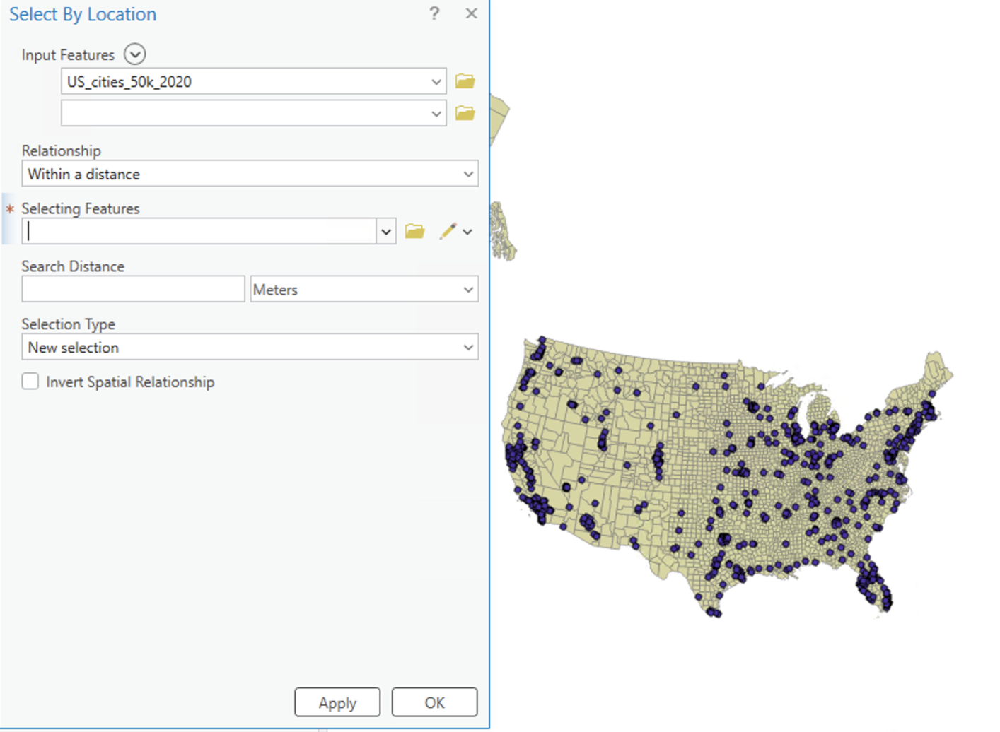{alt="Screenshot of ArcGIS Pro interface"}

# Collecting data in the wild

## What's the process?

- Search open data portal (or similar)
- Find data of interest
- (Look at metadata!)
- Download: often as a shapefile
- Unzip file if necessary
- Open in ArcGIS Pro
- Check projection (often web Mercator simple geographic coordinates)
- Export to a project geodatabase
  - Use "Environment" tab to select the appropriate projection to export the data in

## Why collect our own data?

- When data on the topic we're interested in is not available
- When the variables or characteristics of a place or thing don't exist
- To have a more engaged/subjective view on a topic
- To collect data at a fine spatial resolution (e.g., a bench or a sculpture)

## What will we need if we want to map our data?

- Location, location, location
- For this week: latitude and longitude
  - In decimal format
  - One column for each
- Geographic coordinate system used to ascertain location

## What else do we need to think about?

- What other variables will we need?
- Mappable information:
  - Labels
  - Quantities
  - Values
  - Categories
- Think about the attribute tables we've already worked with…
  - Name / ID
  - Other characteristics (e.g., size or age)
- Categorical data should have categories that are:
  - Exhaustive
  - Mutually exclusive

## Collecting Data: Do It Yourself Mode

- Reliable, evergreen option
  - Pen and paper
  - Excel spreadsheet
  - Clipboard
- Key: you need a location variable
  - Think about scale
  - For this week: latitude and longitude (but there are lots of other options)
- Straightforward option: use Google or Apple maps
  - WGS84 (World Geodetic System 1984)

## 

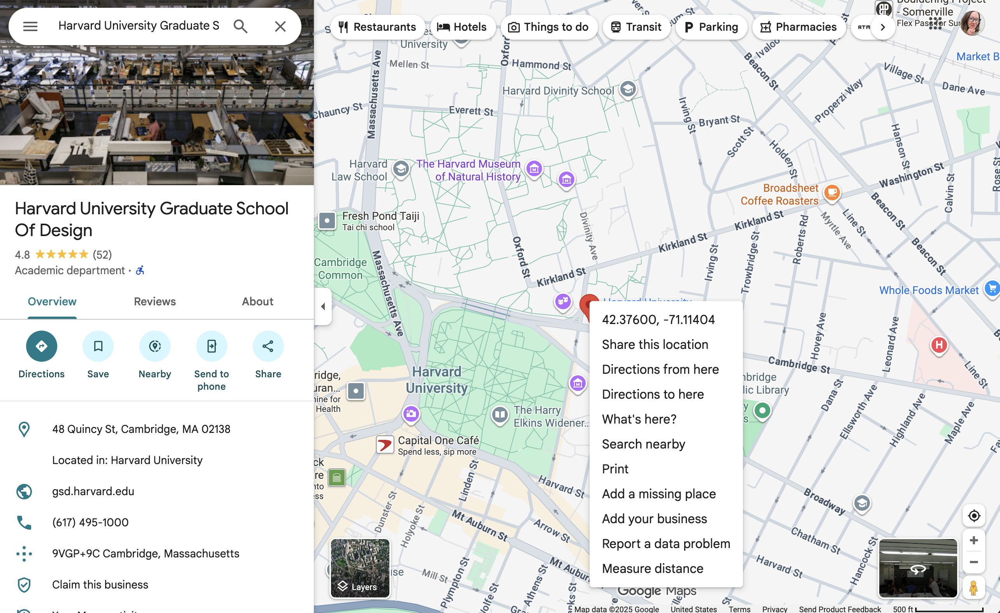{alt="Screenshot of Google maps"}

Google Maps: right click on a pin for lat/long, then copy

## 

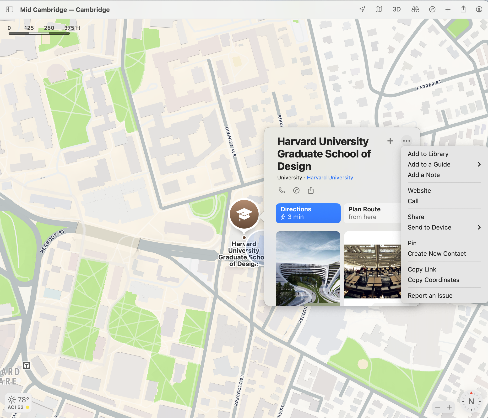{alt="Screenshot of Apple Maps"}

Apple Maps: click … and choose copy coordinates

## Alternative: Compass apps

:::: {.columns}

::: {.column width="30%"}
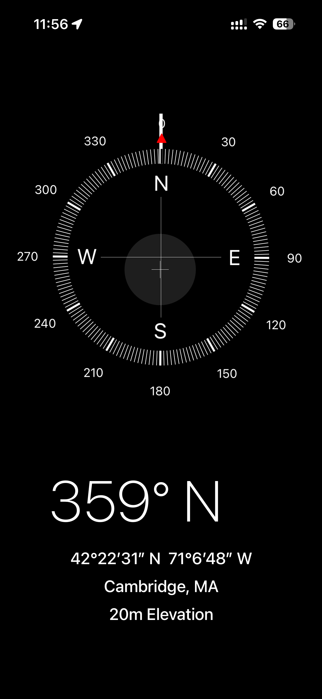{alt="Screenshot of iPhone Compass app" width="70%"}

:::

::: {.column width = "70%"}

\

- For example, iPhone Compass app provides current latitude and longitude
- BUT:
  - What is N? (latitude)
  - What is W? (longitude)
  - And how to deal with degrees, minutes, and seconds?

:::

::::

## Converting Latitude and Longitude into decimal

- GIS software will expect lat/long to be in decimal format, not degrees, minutes, seconds.
  - 42.375801, -71.113794 not 42°22'31" N, 71°6'48" W
- What to do?
  - Web converters
  - Formula:

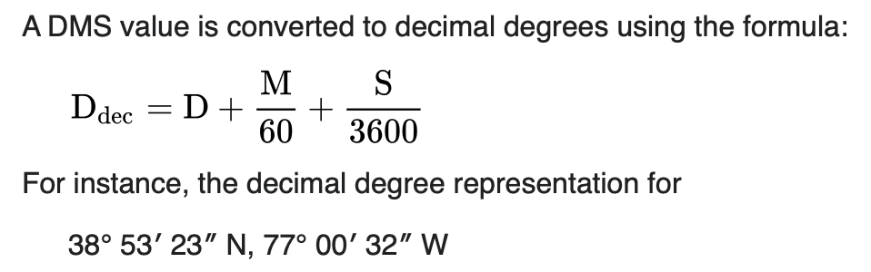{alt="Formula screenshot"}

[Source: https://en.wikipedia.org/wiki/Decimal_degrees](https://en.wikipedia.org/wiki/Decimal_degrees)

## Another option: online forms

- Lots of apps exist to help make this process easier
- You can use one called Jotform
  - Free
  - Has lots of options for types of data it can collect, including location
- Create an account (I used my Brown gmail)
- Create a form
- Go out in the field and collect responses with laptop or phone (recommended)

## Jotform

{alt="Screenshot of Jotform interface"}

## Add questions to your new form

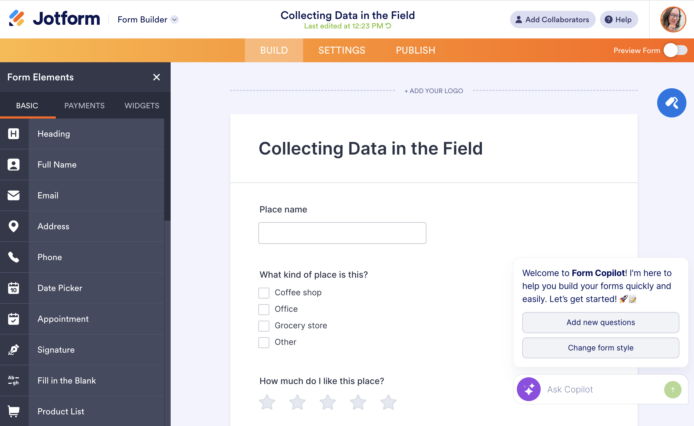{alt="Screenshot of Jotform interface"}

## Lots of options…

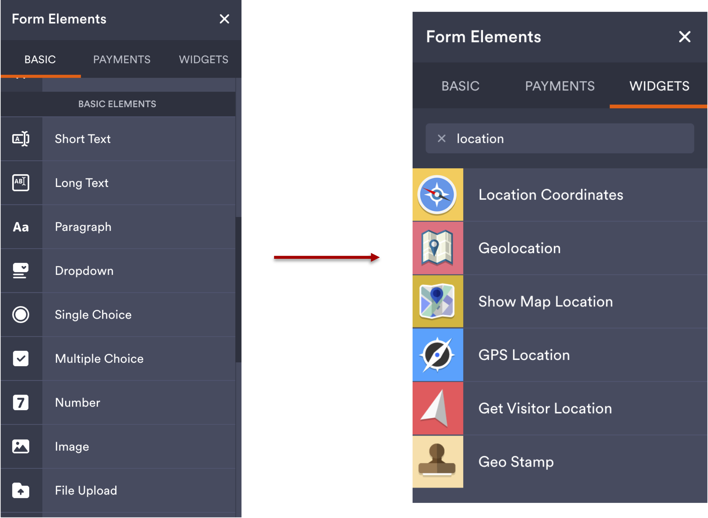{alt="Screenshot of Jotform interface"}

## 

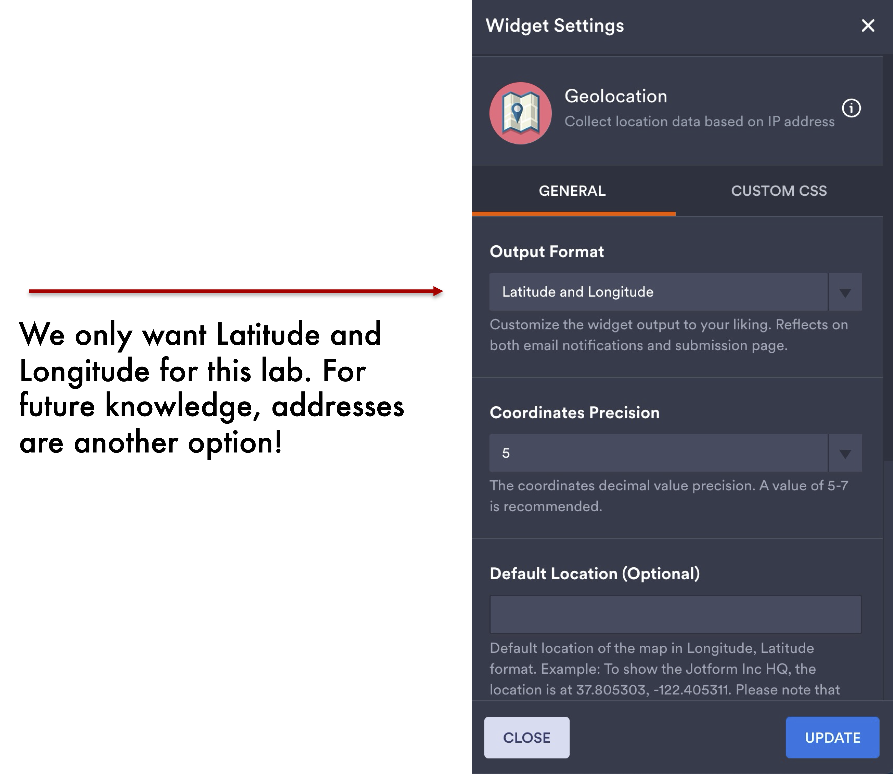{alt="Screenshot of Jotform interface"}

We only want Latitude and Longitude for this lab. For future knowledge, addresses are another option!

## What next?

:::: {.columns}

::: {.column width = "50%"}
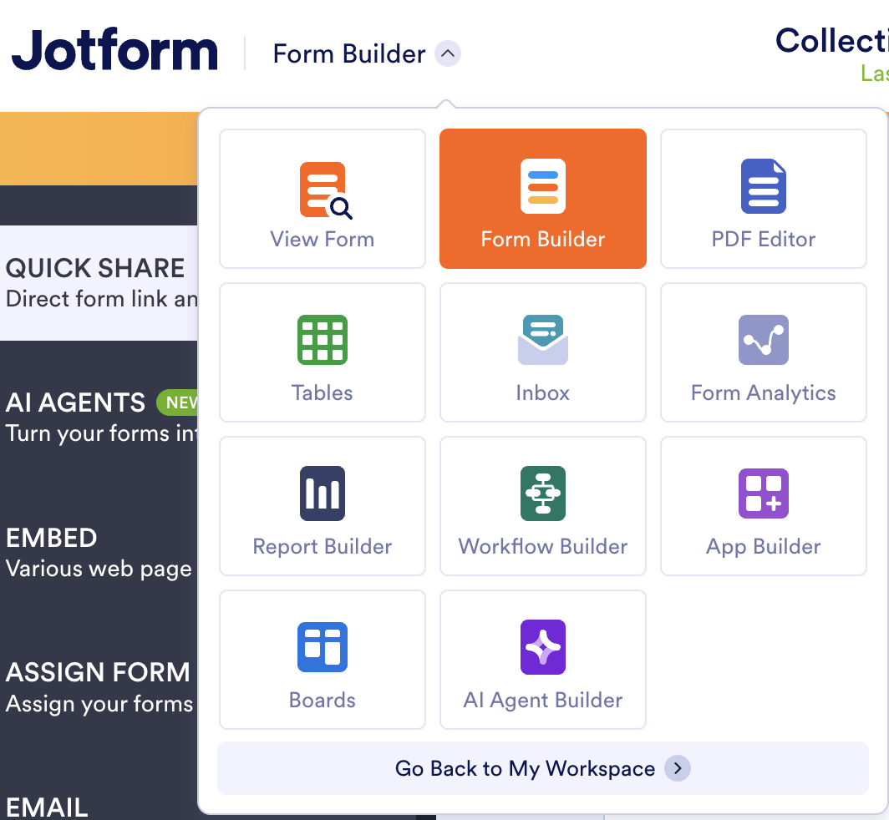{alt="Screenshot of Jotform interface"}
:::

::: {.column width = "50%"}
\

- You can collect data using your laptop and the "view form" option
- Or download the Jotform app and then collect your data (recommended)
- Download your data file under \<Tables\> in Excel format

:::

::::

## How this all works in practice

- **At home**: decide what you want to collect data about
  - Topic
  - But also variables of interest
- **Out in the "field"**:
  - Visit each location and collect the information you need on all the variables
  - PLUS location (from Compass app, directly onto laptop, by saving locations in your map app, or with Jotform
- Everything goes into one spreadsheet, which we clean in Excel, save as csv and then add to an ArcGIS Pro project

## Example Data

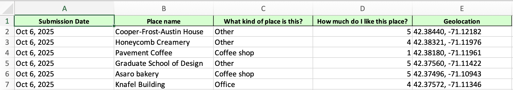{alt="Screenshot of Excel spreadsheet"}

- What do we need to fix before we import into ArcGIS Pro?
- Once our data are "clean" we save as a csv file!

## 

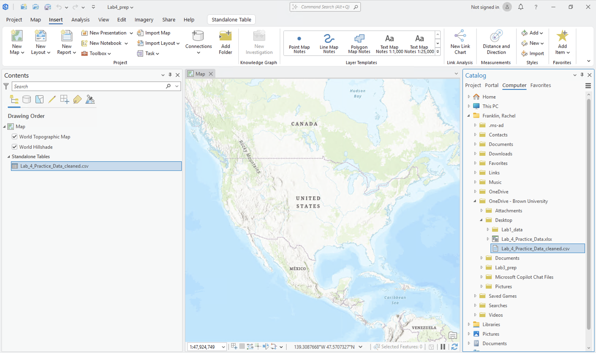{alt="Screenshot of ArcGIS Pro"}

CSV table gets added to new ArcGIS Pro project

## 

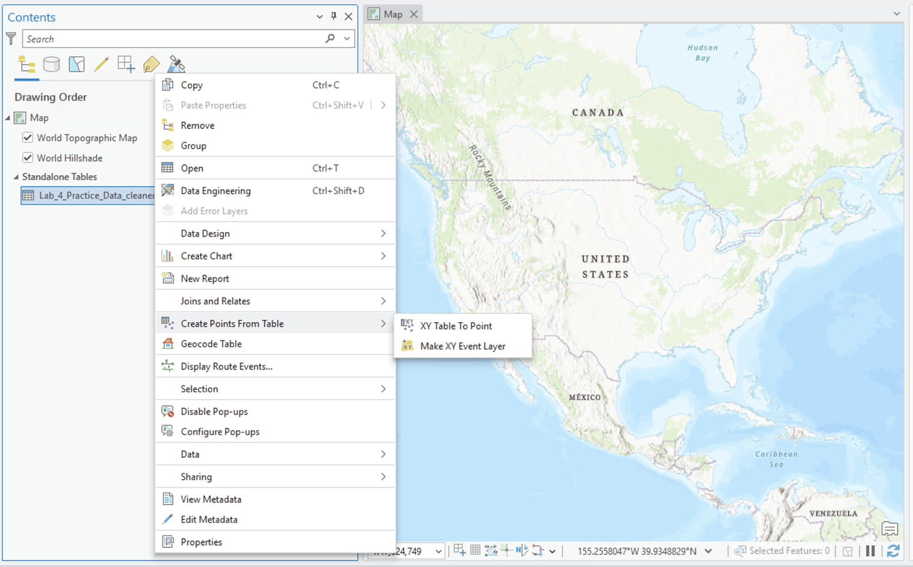{alt="Screenshot of ArcGIS Pro"}

Right click on table to get to Create Points From Table > XY Table to Point

## 

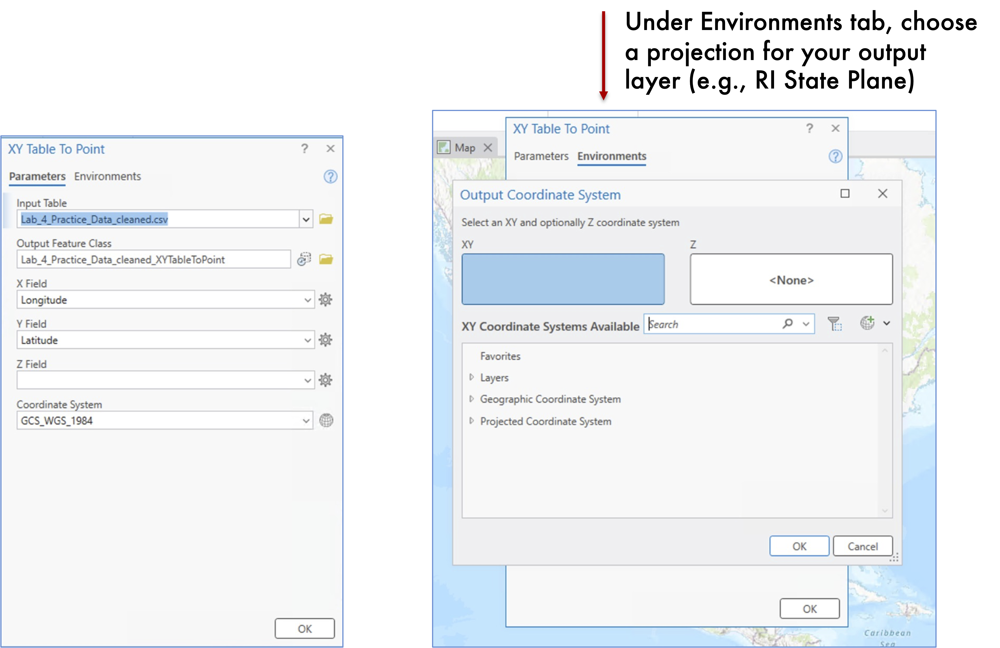{alt="Screenshot of ArcGIS Pro"}

1. Choose a name for new layer; check save location

2. Make sure Lat and Long fields are correct

## And voilà! You've created spatial data! {.center}
